<div align="center">

<!-- HEADER ANIMADO -->


<!-- TYPING EFFECT -->
<p>
  
</p>

<!-- ANIMATED CODING GIF -->


</div>

---

## 🚀 Sobre Mim

```typescript
const gabriel = {
  name: "Gabriel Peron",
  birthDate: "19/02/2001",
  role: "Full Stack Developer & Tech Leader",
  location: "Sales Oliveira, São Paulo - Brasil 🇧🇷",
  yearsOfExperience: "Desde os 15 anos (2016)",

  mainLanguages: ["Java", "TypeScript", "JavaScript", "Python", "C#"],
  frameworks: ["React", "Next.js", "Node.js", "Ruby"],
  databases: ["SQL", "PostgreSQL", "MongoDB", "NoSQL"],
  specialties: [
    "Big Data (Scala, Java, Python)",
    "APIs",
    "Sistemas Empresariais",
  ],

  education: {
    current: "Engenharia de Software - Anhanguera",
    harvard: ["CS50", "Python, SQL, JavaScript, HTML & CSS", "Data Science"],
    previous: "Ciências da Computação - Unifran (4 anos)",
  },

  experience: {
    current: "DGtecnologia - Desenvolvimento e Manutenção (2024-2025)",
    infovip: "Segurança da Informação ISO/IEC 27001/27701 (2024)",
    dmon: "Automação Empresarial (2020-2021)",
    femusi: "Mapeamento de Códigos (2019-2020)",
  },

  personality: ["Observador", "Analítico", "Baseado em Lógica"],
  earlyAchievements: "IA para apoio psicológico antes dos 17 anos",
  researchHighlight: "Fantástico (2025) - IA e Saúde Mental",
  motto: "Clean code. Clear architecture. Continuous learning. 📚",
};
```

<div align="center">

### 💡 **Desenvolvedor desde os 15 anos | Foco em qualidade, estrutura e raciocínio lógico**

### 🎯 **Ampla experiência em Java | Facilidade para estruturar e racionalizar código**

</div>

---

## 🛠️ Tech Stack

<div align="center">

### 💻 Main Languages

<p>
  
  
  
  
  
  
  
  
  
  
  
  
  
  
  
  
  
  
  
  
  
  
  
  
  
  
  
  
  
  
</p>

### ⚡ Frameworks & Runtime

<p>
  
  
  
  
  
  
  
  
  
  
  
  
  
  
  
  
  
  
  
  
  
  
  
  
  
  
</p>

### 🗄️ Databases & Big Data

<p>
  
  
  
  
  
  
  
  
  
  
  
  
  
  
  
  
  
  
  
  
  
  
</p>

### 🛠️ Tools & DevOps

<p>
  
  
  
  
  
  
  
  
  
  
  
  
  
  
  
  
  
  
  
  
  
  
  
  
  
  
  
  
  
  
  
  
  
  
  
  
  
  
  
  
</p>

### 🎨 Frontend & Design

<p>
  
  
  
  
  
  
  
  
  
</p>

</div>

---

## 📊 GitHub Analytics

<div align="center">


<!-- TROPHY -->


</div>

---

## 🌟 Destaques

<div align="center">

### 🎓 Formação de Destaque

<table>
<tr>
<td width="50%">

**🏛️ Harvard University - CS50**

✅ **Introdução a Ciências da Computação**  
✅ **C, Python, SQL, JavaScript, HTML & CSS**  
✅ **Ciência de Dados**

<sub>Certificados Completos</sub>

</td>
<td width="50%">

**🎯 Engenharia de Software**

Graduação em andamento  
**Anhanguera**

---

**💻 Ciências da Computação**

4 anos completos  
**Unifran**

</td>
</tr>
</table>

### 📺 Pesquisa Renomada

<table>
<tr>
<td width="50%">

**Inteligência Artificial e Saúde Mental**

Pesquisa apresentada no **Jornal Fantástico** (2025) 📺

- IA e seus riscos para a psique humana
- Benefícios terapêuticos
- Uso responsável e ético
- Impacto social

</td>
<td width="50%">


**🚀 Projeto Pioneiro**

IA voltada ao apoio psicológico  
_Desenvolvida antes dos 17 anos_

</td>
</tr>
</table>

</div>

---

## 💼 Experiência Profissional

```mermaid
graph LR
    A[Femusi<br/>2019-2020] -->|Crescimento| B[Dmon<br/>2020-2021]
    B -->|Evolução| C[Infovip<br/>2024]
    C -->|Atual| D[DGtecnologia<br/>2024-2025]
    style A fill:#1a1a2e
    style B fill:#16213e
    style C fill:#0f3460
    style D fill:#00d9ff
```

<div align="center">



</div>

<table align="center">
<tr>
<td align="center" width="50%">

### 🏢 DGtecnologia

**2024 - 2025** | _Atual_

**Desenvolvimento e Manutenção de Softwares**

- Arquitetura de sistemas
- Desenvolvimento full stack
- Manutenção e evolução
- Liderança técnica

</td>
<td align="center" width="50%">

### 🏢 Infovip Tecnologia

**2024**

**Segurança da Informação**

- ISO/IEC 27001
- ISO/IEC 27701
- Compliance & Auditoria
- Gestão de Riscos

</td>
</tr>
<tr>
<td align="center" width="50%">

### 🏢 Dmon

**2020 - 2021**

**Manutenção e Programação**

- Sistemas de automação empresarial
- Otimização de processos
- Integração de sistemas

</td>
<td align="center" width="50%">

### 🏢 G. Femusi

**2019 - 2020**

**Desenvolvimento de Mapeamento**

- Códigos para peças
- Sistemas de rastreamento
- Primeiros passos profissionais

</td>
</tr>
</table>

---

## 🎯 Perfil & Características

<div align="center">

<table>
<tr>
<td align="center" width="33%">

### 🧠 Mentalidade

**Observador**<br/>
**Analítico**<br/>
Resposta baseada em<br/>
**lógica e evidências**

</td>
<td align="center" width="33%">

### 💻 Especialidades

**Estruturar código**<br/>
**Racionalizar soluções**<br/>
Ampla experiência<br/>
**em Java**

</td>
<td align="center" width="33%">

### 🚀 Trajetória

**Desde os 15 anos**<br/>
Desenvolvimento de jogos<br/>
IA para saúde mental<br/>
**Evolução contínua**

</td>
</tr>
</table>

### 📚 Áreas de Interesse

<p>
  
  
  
  
  
</p>

</div>

---

## 📫 Vamos Conectar?

<div align="center">

<a href="https://github.com/garpP" target="_blank">
  
</a>
<a href="https://www.linkedin.com/in/gabriel-peron-7bb080277/" target="_blank">
  
</a>
<a href="https://wa.me/5516993643272" target="_blank">
  
</a>
<a href="https://wa.me/5516993643272" target="_blank">
  
</a>

</div>

---

<div align="center">

### 💭 Pensamento do Dia


</div>

---

<div align="center">

### 👀 Visitantes do Perfil


### ⚡ Fun Fact

 **Coffee + Code = ❤️**

</div>

---

<!-- FOOTER ANIMADO -->


<div align="center">
  
### 🌟 *"Clean code. Clear architecture. Continuous learning."* 🌟

**⭐ Se você gostou do meu perfil, deixe uma estrela em algum repositório! ⭐**

</div>
